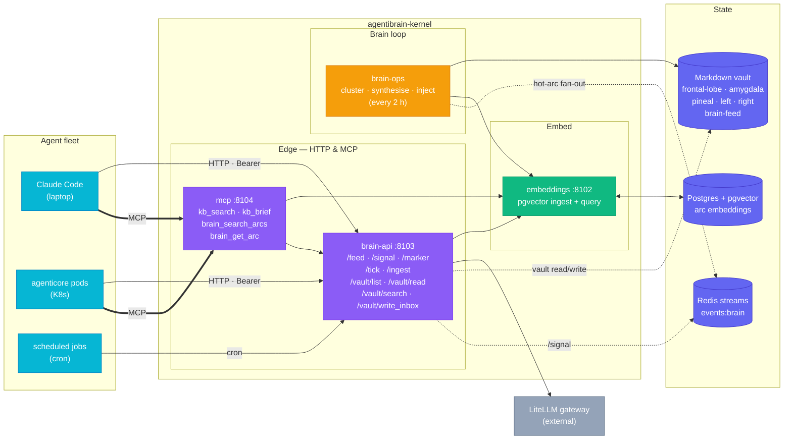
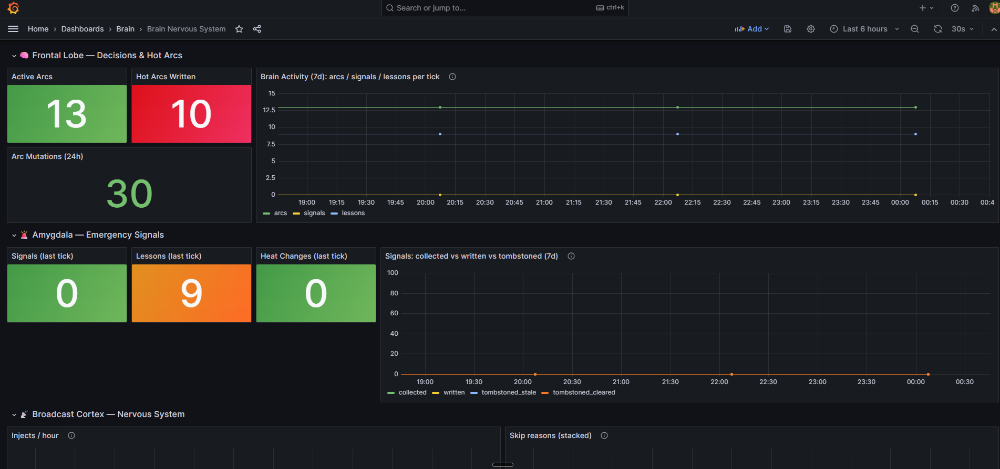

# agentibrain-kernel

> A standalone brain + knowledge-base kernel for Claude Code agent fleets. Bring your own vault, your own LLM keys, your own embeddings. Runs on a laptop, a server, or a Kubernetes cluster.

## Quick Start (Docker Compose)

### 1. Clone and bootstrap

```bash
git clone https://github.com/The-Cloud-Clockwork/agentibrain-kernel.git
cd agentibrain-kernel
./local/bootstrap.sh      # generates ~/.agentibrain/.env, symlinks to repo, scaffolds ./vault
```

### 2. Configure your LLM provider (optional)

Edit `~/.agentibrain/.env` — set at minimum one API key to enable semantic search:

```env
# Required for embeddings (semantic search) — OpenAI or any compatible provider
LLM_API_KEY=<your-openai-key>
LLM_API_BASE=https://api.openai.com/v1    # or your LiteLLM proxy

# Required for AI tick + kb_brief synthesis — any OpenAI-compatible endpoint
INFERENCE_URL=https://api.openai.com/v1
INFERENCE_API_KEY=<your-openai-key>
```

**No API key at all?** The brain still works — `brain_ingest`, `kb_search` (vault text), `brain_get_arc` all function. Only semantic search and AI synthesis are disabled.

**Free local alternative (Ollama):**
```bash
docker compose -f compose.yml -f local/compose.ollama.yml up -d
docker compose exec ollama ollama pull llama3.2
```

### 3. Start

```bash
docker compose up -d    # 8 containers: postgres, redis, brain-api,
                        # embeddings, mcp, tick-cron, tick-drain, amygdala
docker compose ps       # all healthy
curl http://localhost:8104/ping  # pong — MCP server is up
```

### 4. Wire Claude Code

Add to your project or user MCP config (e.g. `~/.claude/.mcp.json`):

```json
{
  "mcpServers": {
    "agentibrain": {
      "type": "sse",
      "url": "http://localhost:8104/sse"
    }
  }
}
```

Restart Claude Code, run `/mcp` — you'll see `agentibrain` with 5 tools:

| Tool | Purpose |
|------|---------|
| `kb_search` | Federated search (embeddings + vault text) |
| `kb_brief` | Search + LLM synthesis (3-5 line brief) |
| `brain_search_arcs` | Semantic search over brain arcs |
| `brain_get_arc` | Fetch full arc by cluster_id |
| `brain_ingest` | Write text to the brain vault |

### 5. Wire agentihooks profile (required for full brain injection)

> **agentihooks is required for the full brain experience.**
> Without it, you get the HTTP API and MCP tools — but agents won't
> receive automatic context injection (hot arcs, signals, broadcasts),
> won't have their `@marker` comments captured, and won't see amygdala
> alerts. The hooks layer (`brain_adapter`, `brain_writer_hook`,
> `amygdala_hook`) is what makes the brain *live* inside Claude Code
> sessions. API-only usage (curl / SDK) works without agentihooks.

Install [agentihooks](https://github.com/The-Cloud-Clockwork/agentihooks) ([PyPI](https://pypi.org/project/agentihooks/)):

```bash
pip install agentihooks
```

Then link the brain profile so your agents get brain MCP tools + marker rules + broadcast channel config:

```bash
agentihooks link-profile link "$(pwd)/profiles/brain"
```

What this gives you:
- **SessionStart** — `brain_adapter` calls `/feed` and injects hot arcs, signals, operator intent, and tick diffs as `BROADCAST` blocks into every agent session
- **Every turn** — `amygdala_hook` polls `/signal` for nuclear/critical alerts
- **Every 30 turns** — `brain_adapter` re-fetches `/feed` and re-injects if content changed
- **SessionStop** — `brain_writer_hook` scans transcripts for `@lesson`, `@milestone`, `@signal`, `@decision` markers and POSTs them to `/marker`

### 6. Test it

```bash
TOK=$(grep ^KB_ROUTER_TOKEN .env | cut -d= -f2)

# Write something to the brain
curl -X POST http://localhost:8103/ingest \
  -H "Authorization: Bearer $TOK" \
  -F "message=The quick brown fox jumped over the lazy dog"

# Search for it
curl -X POST http://localhost:8103/search \
  -H "Authorization: Bearer $TOK" \
  -H "Content-Type: application/json" \
  -d '{"query": "fox"}'
```

Content lands in `./vault/raw/inbox/`. The tick drains it to a region dir, recomputes heat, and updates brain-feed.

**Force a tick on demand** (don't wait for the 2h scheduled cycle):

```bash
pip install -e .                          # one-time, installs the `brain` CLI
brain tick --no-ai --wait                 # deterministic-only, blocks until done
brain tick --wait                         # full AI tick
brain tick --dry-run --wait               # read-only verify, no writes
```

The `tick-drain` service polls `brain-feed/ticks/requested/` every 30s and runs `brain_tick.py` per request — same UX as the K8s `tick-drain` CronJob. Scheduled ticks still run every `TICK_INTERVAL_SECONDS` (default 2h) via `tick-cron`.

See [`local/README.md`](local/README.md) for full local docs, troubleshooting, port overrides, and inference modes.

---

`agentibrain` is a pillar of the **agenti ecosystem** alongside
[`agenticore`](https://github.com/The-Cloud-Clockwork/agenticore) ·
[`agentihooks`](https://github.com/The-Cloud-Clockwork/agentihooks) ·
[`agentibridge`](https://github.com/The-Cloud-Clockwork/agentibridge) — and the **brain layer** every other pillar plugs into. It is self-contained: ships its own services, Helm charts, brain-keeper agent definition, and brain profile overlays, so any fleet of Claude Code agents can read from and write back to a single HTTP brain.

---

## Why

AI agents have no long-term memory. Every session boots blind and forgets everything it learned the moment it exits. The usual fix — "ask the model to remember" — leaks state into prompts, burns tokens, and can't be shared across sessions.

**agentibrain is the filesystem-first alternative.** Memory lives outside the model, in a structured markdown vault you can open in Obsidian. A scheduled *tick* (deterministic + LLM-assisted) writes hot arcs, signals, decay, and synthesis into the vault. A single HTTP kernel fans that vault out to every agent in your fleet over a tiny REST contract.

Four services, one vault, one HTTP contract — no AWS lock-in, no proprietary storage, no vendor SDK.

---

## What you get



| Service | Port | Role |
|---|---|---|
| **brain-api** | 8103 | Brain HTTP contract — vault read/write, ingest, `/feed`, `/signal`, `/marker`, `/tick` |
| **embeddings** | 8102 | pgvector wrapper — `/embed`, `/search`, OpenAI-compatible |
| **mcp** | 8104 | MCP retrieval tools — `kb_search`, `kb_brief`, `brain_search_arcs`, `brain_get_arc` |
| **brain-ops** | — | Hybrid 2-hour tick (deterministic clustering + optional LLM synthesis), on-demand drain (polls `brain-feed/ticks/requested/`), and amygdala consumer |

Plus an **opt-in `brain-keeper`** agent (ops oracle for triage, enrichment, replay) and **six Helm charts** for Kubernetes (`brain-api`, `embeddings`, `mcp`, `brain-ops`, `brain-keeper`).

---

## Install

### 1. Laptop (Docker Compose)

```bash
git clone https://github.com/The-Cloud-Clockwork/agentibrain-kernel.git
cd agentibrain-kernel
./local/bootstrap.sh           # writes .env (random tokens) + scaffolds ./vault
docker compose up -d           # 8 containers come up
```

> **Note:** the default Compose stack **builds the 4 service images locally** from `services/*/Dockerfile` on first run (~5 min). To pull pre-built images instead, see [Images & forking](#images--forking).

Smoke test:

```bash
TOK=$(grep ^KB_ROUTER_TOKEN .env | cut -d= -f2)
curl -H "Authorization: Bearer $TOK" http://localhost:8103/feed | jq .
```

You should see `hot_arcs`, `inject_blocks`, `entries`. On a fresh vault these arrays start mostly empty — they fill as ticks run and as you write markers.

Add a local LLM (Ollama, no API key needed):

```bash
docker compose -f compose.yml -f local/compose.ollama.yml up -d
docker compose exec ollama ollama pull llama3.2
```

Three more inference overlays in [`examples/compose/`](examples/compose/) — Ollama, OpenAI direct, LiteLLM gateway. Full local guide: [`local/README.md`](local/README.md).

### 2. Server (Docker Compose, headless)

Same `compose.yml` works on any Linux box with Docker. Bind the vault to a real path, expose `8103` behind your reverse proxy of choice (Traefik, Caddy, nginx), point your fleet at it via `BRAIN_URL`. No Kubernetes required.

### 3. Kubernetes (Helm)

Six charts ship in [`helm/`](helm/) — `brain-api`, `embeddings`, `mcp`, `brain-ops`, `brain-keeper`. The first four depend on `tcc-k8s-service-template:0.3.8` (vendored as `.tgz` under each chart's `charts/` for offline install). `brain-ops` is a custom 3-template chart for the CronJob + amygdala consumer.

#### Step 1 — Scaffold the vault on persistent storage

Copy the template tree straight onto the volume:

```bash
git clone https://github.com/The-Cloud-Clockwork/agentibrain-kernel
cp -r agentibrain-kernel/agentibrain/templates/vault-layout/* /mnt/<your-export>/
```

The kernel images expect this layout under `/vault` (see [`docs/VAULT-SCHEMA.md`](docs/VAULT-SCHEMA.md)). Idempotent — re-running just refreshes any missing files.

#### Step 2 — Provision Secrets

**Path A — plain Opaque Secret (simplest, no External Secrets Operator):**
```bash
./local/k8s-bootstrap.sh --apply -n <your-namespace>
```
Creates three Secrets (`agentibrain-router-secrets`, `embeddings-secrets`, `agenticore-secrets`) with random tokens. Tokens persist in `local/.k8s-tokens` for re-use.

**Path B — External Secrets Operator (GitOps-tracked):**
Wire your secrets manager (OpenBao / AWS Secrets Manager / Vault) via an ESO `ClusterSecretStore`, then set `externalSecret.enabled: true` in your values overlay. Full walkthrough: [`docs/SECRETS.md`](docs/SECRETS.md).

#### Step 3 — `helm install` the six charts

```bash
helm install agentibrain-brain-api    ./helm/brain-api    -f values-brain-api.yaml
helm install agentibrain-embeddings   ./helm/embeddings   -f values-embeddings.yaml
helm install agentibrain-mcp          ./helm/mcp          -f values-mcp.yaml
helm install agentibrain-brain-ops   ./helm/brain-ops   -f values-brain-ops.yaml   # singleton, deploy ONCE per cluster
helm install agentibrain-brain-keeper ./helm/brain-keeper -f values-brain-keeper.yaml # OPTIONAL ops oracle (see note below)
```

Each `values-*.yaml` overlay sets:
* `extraVolumes` → NFS server + path or PVC claim for the vault from step 1 (brain-api mounts vault at `/vault`)
* `env.variables.INFERENCE_URL` + `BRAIN_CLASSIFY_MODEL` + `BRAIN_BRIEF_MODEL` → your LLM gateway + model names
* `secrets.external.secretRef` → the Secret from step 2

Sample overlays + ArgoCD `Application` CRs ship in [`examples/`](examples/) — copy, replace every `<your-*>` placeholder, deploy.

> **Note on `brain-keeper`** — this StatefulSet is the optional ops-oracle agent for triage / enrichment / replay. It runs the [`agenticore`](https://github.com/The-Cloud-Clockwork/agenticore) image, which is built and published by that **upstream repo, not by this kernel**. The brain functions fully without `brain-keeper` — skip the chart if you don't need it, or fork agenticore and override `image.repository` to deploy under your own namespace.

#### Optional — ArgoCD instead of `helm install`

Same outcome, declarative. Copy `examples/argocd/` into your platform repo, swap placeholders, `kubectl apply -f` the `agentibrain-root.yaml`. ArgoCD picks up the per-service Apps and the chart sources point back at this kernel repo via multi-source.

Once running, every agent in your fleet gets two env vars and consumes the brain over HTTP:

```yaml
BRAIN_URL: http://agentibrain-brain-api.<your-namespace>.svc:8080
KB_ROUTER_TOKEN: <from-the-secret-in-step-2>
```

Architecture reference: [`docs/architecture/ARCHITECTURE.md`](docs/architecture/ARCHITECTURE.md). Generic deployment guide: [`docs/DEPLOYMENT.md`](docs/DEPLOYMENT.md).

---

## Connect Claude Code

After install, register the kernel's MCP server with Claude Code so the agent can reach the brain via five tools (`kb_search`, `kb_brief`, `brain_search_arcs`, `brain_get_arc`, `brain_ingest`).

### Laptop (Docker Compose)

Add to `~/.claude/.mcp.json` or your project-local `.mcp.json`:

```json
{
  "mcpServers": {
    "agentibrain": {
      "type": "sse",
      "url": "http://localhost:8104/sse"
    }
  }
}
```

Restart Claude Code, then verify with `/mcp` — the `agentibrain` server should appear with 5 tools (`mcp__agentibrain__kb_search`, etc.).

> **Note:** the local compose stack runs mcp-proxy without auth (localhost-only). For production deployments, set `MCP_PROXY_API_KEY` on the container and use `x-api-key` header.

### Kubernetes (agent-mode pod)

For Claude Code running in agent mode inside a pod, point at the in-cluster Service URL of the `mcp` chart:

```json
{
  "mcpServers": {
    "agentibrain": {
      "type": "sse",
      "url": "http://agentibrain-mcp.<your-namespace>.svc:8080/sse",
      "headers": {
        "x-api-key": "${MCP_PROXY_API_KEY}"
      }
    }
  }
}
```

Inject `MCP_PROXY_API_KEY` via `envFrom: secretRef:` from the K8s Secret backing the `mcp` chart (`agentibrain-mcp-secrets` by default).

### agentihooks profile (required for Claude Code brain injection)

[agentihooks](https://github.com/The-Cloud-Clockwork/agentihooks) ([PyPI](https://pypi.org/project/agentihooks/)) is the hook framework that wires AgentiBrain into Claude Code sessions. **Without it, agents can query the brain via MCP tools but won't receive automatic context injection, marker capture, or amygdala alerts.**

```bash
pip install agentihooks
agentihooks link-profile link /path/to/agentibrain-kernel/profiles/brain
```

The brain profile registers three hooks:
| Hook | Trigger | What it does |
|---|---|---|
| `brain_adapter` | SessionStart + every 30 turns | Reads `/feed`, injects hot arcs, signals, intent, tick diffs as `BROADCAST` blocks |
| `brain_writer_hook` | SessionStop | Scans transcript for `@lesson` `@milestone` `@signal` `@decision` markers, POSTs to `/marker` |
| `amygdala_hook` | Every turn | Polls `/signal` for nuclear/critical severity, injects `BROADCAST [CRITICAL]` |

> **The bundled profile ships the local SSE server only.**
> `profiles/brain/.claude/.mcp.json` contains a single entry —
> `agentibrain-local` (`type: sse` → `http://localhost:8104/sse`), pointing at
> the local Docker-Compose stack. No remote entry is bundled: the `mcp` chart's
> Service is `ClusterIP` with no Ingress, so `agentibrain-mcp.<ns>.svc:8080`
> resolves only inside the cluster — usable from in-cluster agent pods (see
> [Kubernetes](#kubernetes-agent-mode-pod) above), unreachable from anywhere
> else.
>
> To reach the brain MCP from outside the cluster, expose it on a routable
> surface — an Ingress, or behind an MCP gateway — then add your own entry.
> Whichever you choose, authenticate with the `x-api-key` header (not
> `Authorization: Bearer`), path `/mcp` (streamable HTTP) or `/sse`, key
> `MCP_PROXY_API_KEY`.

Full reference (incl. LiteLLM gateway path): [`docs/MCP.md`](docs/MCP.md).

---

## Images & forking

The kernel publishes 4 service images via GitHub Actions. **Standard consumers don't build anything** — pull and go.

| Image | Source | Tag |
|---|---|---|
| `ghcr.io/the-cloud-clockwork/agentibrain-brain-api` | `services/brain-api/` | `:dev` |
| `ghcr.io/the-cloud-clockwork/agentibrain-embeddings` | `services/embeddings/` | `:dev` |
| `ghcr.io/the-cloud-clockwork/agentibrain-mcp` | `services/mcp/` | `:dev` |
| `ghcr.io/the-cloud-clockwork/agentibrain-brain-ops` | `services/brain-ops/` | `:dev` |

CI: [`.github/workflows/docker-build.yml`](.github/workflows/docker-build.yml) runs on every push to `dev` (→ `:dev`). `main` is vestigial; `:latest` is not published.

| Path | Builds locally? | Pulls from GHCR? |
|---|:---:|:---:|
| `docker compose up -d` (default) | ✅ first run, ~5 min | ❌ |
| Helm charts | ❌ | ✅ all 4 service images |
| Air-gapped install | ✅ via your registry mirror | n/a |

**For forkers:** push to your fork's `dev` or `main`, the same workflow runs under your namespace and publishes to `ghcr.io/<your-org>/agentibrain-*`. Edit each chart's `image.repository` (or your values overlay) to point at your namespace. The vendored `tcc-k8s-service-template-0.3.8.tgz` makes `helm install` work offline; refresh from upstream with `helm dep update helm/<chart>`.

The `agenticore` image used by the optional `brain-keeper` chart is built by the [`agenticore`](https://github.com/The-Cloud-Clockwork/agenticore) repo, not here.

---

## HTTP contract

Bearer auth via `KB_ROUTER_TOKEN` on every endpoint. Base URL below is `$BRAIN_URL`.

### `GET /feed` — hot arcs + inject blocks

```bash
curl -s "$BRAIN_URL/feed" -H "Authorization: Bearer $KB_ROUTER_TOKEN"
```

```json
{
  "hot_arcs":      [ { "id", "title", "content", "priority", "ttl", "severity" }, ... ],
  "inject_blocks": [ ... ],
  "entries":       [ ... ],
  "generated_at":  "2026-04-27T18:08:00+00:00",
  "hash":          "c4d87ac3f961be48",
  "entry_count":   5
}
```

Cached server-side for `FEED_CACHE_TTL_SECONDS` (default 30s). Read on every agent's SessionStart.

### `GET /health` — liveness probe

Returns `{ "status": "ok" }`.

### `GET /signal` — current amygdala alert

Empty `amygdala-active.md` → `{ "active": false, ... }`. Dedup via `hash`.

### `POST /marker` — emit a brain marker

| Type | Routes to | Mode |
|---|---|---|
| `lesson` | `left/reference/lessons-YYYY-MM-DD.md` | append |
| `milestone` | `left/projects/<source>/BLOCKS.md` if dir exists, else `daily/YYYY-MM-DD.md` | append |
| `signal` | `amygdala/<timestamp>-<severity>-<slug>.md` | new file |
| `decision` | `left/decisions/ADR-NNNN-<slug>.md` (auto-numbered) | new file |

```bash
curl -s -X POST "$BRAIN_URL/marker" \
  -H "Authorization: Bearer $KB_ROUTER_TOKEN" \
  -H "Content-Type: application/json" \
  -H "X-Idempotency-Key: session-abc-first-lesson" \
  -d '{"type":"lesson","content":"NFS dirs need 777 for UID 1000 writers","attrs":{"source":"deploy"}}'
```

Idempotency-key window 1h (configurable via `IDEMPOTENCY_TTL_SECONDS`). Replay returns the original response with `idempotent_replay: true`.

### `POST /tick` — request a manual brain tick

File-protocol: writes a request to `brain-feed/ticks/requested/`. The `tick-drain` worker picks it up and moves it to `completed/` or `failed/`. Poll `GET /tick/{job_id}`.

CLI wrapper: `brain tick [--dry-run] [--no-ai] [--wait]`. With `--wait`, blocks until the job leaves `requested/`.

### `POST /ingest` — universal ingest

Free-text in. The model named in `BRAIN_CLASSIFY_MODEL` classifies via your inference gateway (any OpenAI-compatible — see [`docs/GATEWAY-CONTRACT.md`](docs/GATEWAY-CONTRACT.md)), fans URLs/repos/files to artifact-store, drops a markdown note in `raw/inbox/`. Spec: [`api/openapi.yaml`](api/openapi.yaml).

### `POST /ingest_with_files` — multipart ingest

Same as `/ingest` but accepts file attachments as `multipart/form-data`.

### `POST /index_artifact` — sole brain-side embedding write

Per-artifact embedding write surface. Called by ingest pipelines after artifact-store accepts a blob. Every embed flows through this endpoint. Spec: [`api/openapi.yaml`](api/openapi.yaml).

### Vault endpoints

All vault reads and writes flow through brain-api (which mounts `/vault` directly):

| Endpoint | Method | Purpose |
|---|---|---|
| `/vault/list` | GET | List vault files under a path |
| `/vault/read` | GET | Read a vault file by path |
| `/vault/search` | GET | Full-text search across the vault |
| `/vault/write_inbox` | POST | Write a file to `raw/inbox/` |

---

## Vault schema

Obsidian-compatible folder tree, writable by humans and by kernel services. `brain scaffold` is the authoritative writer of the schema marker; `local/bootstrap.sh` invokes it on first run.

```
<vault>/
  .brain-schema           # version marker (JSON)
  README.md  CLAUDE.md    # vault rules for AI agents

  # Cognitive regions (owned by brain-ops + daemons)
  raw/{inbox,articles,media,transcripts}/
  clusters/               # canonical arc storage
  brain-feed/             # /feed reads here, /tick writes ticks/requested/
  amygdala/               # /marker type=signal lands here
  frontal-lobe/{conscious,unconscious}/
  pineal/                 # joy + breakthrough region

  # Knowledge base (operator owns — agents curate)
  identity/               # who you are — root node
  left/                   # technical hemisphere — projects, research, reference, decisions, incidents
  right/                  # creative hemisphere — ideas, strategy, life, creative, risk
  bridge/                 # cross-hemisphere synthesis
  daily/                  # append-only daily logs

  templates/mubs/         # VISION SPECS BLOCKS TODO STATE BUGS KNOWN-ISSUES ENHANCEMENTS MVP PATCHES
```

Scaffold is idempotent. Schema-version mismatch is a hard error unless `--force-upgrade` is passed. Full reference: [`docs/VAULT-SCHEMA.md`](docs/VAULT-SCHEMA.md).

---

## Configuration

| Env var | Default | Purpose |
|---|---|---|
| `VAULT_ROOT` | `/vault` | Vault mount path inside containers (NFS in K8s, bind mount in Compose) |
| `KB_ROUTER_TOKEN` / `KB_ROUTER_TOKENS` | — | Bearer auth (single token or comma-sep list) |
| `EMBEDDINGS_URL` | `http://embeddings:8080` | Embeddings service URL |
| `EMBEDDINGS_API_KEY` | — | Bearer token for the embeddings service |
| `INFERENCE_URL` | — | OpenAI-compatible LLM gateway. Empty = deterministic-only ticks. See [`docs/GATEWAY-CONTRACT.md`](docs/GATEWAY-CONTRACT.md) |
| `INFERENCE_API_KEY` | — | Bearer token for the inference gateway. Empty = no auth header (trusted-LAN ok) |
| `BRAIN_CLASSIFY_MODEL` | `brain-classify` | Model name for brain-api classifier |
| `BRAIN_BRIEF_MODEL` | `brain-brief` | Model name for `kb_brief` / tick synthesis |
| `MCP_PROXY_API_KEY` | — | Bearer token mcp enforces on inbound calls |
| `FEED_CACHE_TTL_SECONDS` | `30` | `/feed` cache window |
| `IDEMPOTENCY_TTL_SECONDS` | `3600` | `/marker` replay window |
| `TICK_INTERVAL_SECONDS` | `7200` | Tick cadence (compose mode) |

Local mode reads from `.env` (generated by `bootstrap.sh`). K8s mode reads from a `Secret` (Opaque or ESO-synced from your secret store — see [`docs/SECRETS.md`](docs/SECRETS.md)).

---

## Observability

The kernel ships a starter Grafana dashboard at [`observability/brain-health.json`](observability/brain-health.json) — drop it into Grafana to get an immediate picture of the brain's pulse: hot arcs, emergency signals, broadcast traffic, tick cadence, memory markers, and hook health. 27 panels across six brain regions (frontal lobe · amygdala · broadcast cortex · pineal · hippocampus · hook observability), so the layout maps onto the same terminology the kernel uses internally.



**How to wire it.** The JSON is a mock — every panel queries a `grafana-clickhouse-datasource` with `uid: clickhouse`, against the `brain.*` schema that [`services/brain-ops`](services/brain-ops) writes into ClickHouse on every tick (`brain.tick_health`, `brain.signals`, `brain.arcs`, `brain.lessons`, `brain.embeddings`, …). To go from mock to live:

1. **Import** — in Grafana, *Dashboards → New → Import* → paste `observability/brain-health.json`.
2. **Datasource** — install the [ClickHouse datasource plugin](https://grafana.com/grafana/plugins/grafana-clickhouse-datasource/), point it at the ClickHouse instance the brain-ops writes to, and either name its uid `clickhouse` or remap the dashboard's datasource at import time.
3. **Schema** — the queries assume the brain-ops's default table layout. If you've renamed tables or split databases, edit the panel `rawSql` blocks — column names match the `BrainTickHealth` model in [`services/brain-ops/brain_tick.py`](services/brain-ops/brain_tick.py).
4. **Refresh** — default cadence is `30s` over a `now-6h` window; override per your appetite.

If you don't run ClickHouse, the JSON is still useful as a panel layout reference — swap each `rawSql` for the equivalent in your TSDB of choice and keep the structure.

---

## Development

```bash
git clone https://github.com/The-Cloud-Clockwork/agentibrain-kernel
cd agentibrain-kernel
python -m venv .venv && . .venv/bin/activate
pip install -e '.[dev]'

pytest tests/unit                              # scaffold + compose tests
PYTHONPATH=services/brain-api:. pytest services/brain-api/tests -q   # service tests

docker build -t agentibrain-brain-api:local services/brain-api
```

Workflow: `dev` is the working branch and the deploy branch. CI on `dev` ships `:dev` GHCR images automatically. `main` is vestigial.

---

## Status

**v0.1.x — stable.** Six Helm charts. Four service images auto-published to GHCR (`:dev` from dev branch; `:latest` from main is not published). HTTP contract frozen at v1. Generic OpenAI gateway — kernel speaks chat-completions to any compatible upstream (LiteLLM, OpenAI, Ollama, vLLM, …). Brain-blind boundary in place since 2026-04-26 (artifact-store no longer auto-embeds; every embed flows through `POST /index_artifact`). Vault read/write absorbed into brain-api directly via `vault_reader` module — no separate reader service.

The kernel is self-contained and the canonical source of truth for everything brain-related — services, Helm charts, brain-keeper agent definition (`agents/brain-keeper/`), brain profile overlays (`profiles/brain/`, `profiles/brain-keeper/`), and the vault layout schema. All deployment-specific plumbing (cluster namespaces, model name aliases, secret-store paths, NFS hosts) lives in your own platform repo, not here.

Maturity tracking lives in [`operator/`](operator/):
- [`operator/VISION.md`](operator/VISION.md) — what 100% means
- [`operator/STATE.md`](operator/STATE.md) — current snapshot
- [`operator/BLOCKS.md`](operator/BLOCKS.md) — in-flight work
- [`operator/ENHANCEMENTS.md`](operator/ENHANCEMENTS.md) — backlog
- [`operator/TODO.md`](operator/TODO.md) — next actions

---

## Further reading

- [`docs/architecture/ARCHITECTURE.md`](docs/architecture/ARCHITECTURE.md) — full kernel design
- [`docs/architecture/CLUSTERS.md`](docs/architecture/CLUSTERS.md) — arc lifecycle
- [`docs/architecture/KEEPER.md`](docs/architecture/KEEPER.md) — brain-keeper agent
- [`docs/architecture/MARKERS.md`](docs/architecture/MARKERS.md) — marker grammar
- [`docs/architecture/SYMBIOSIS.md`](docs/architecture/SYMBIOSIS.md) — relation to agenticore + agentihooks
- [`docs/architecture/TELEMETRY.md`](docs/architecture/TELEMETRY.md) — OTel + Langfuse
- [`docs/MCP.md`](docs/MCP.md) — MCP server, Claude Code wiring, LiteLLM gateway
- [`docs/SECRETS.md`](docs/SECRETS.md) — Opaque Secrets vs ESO
- [`docs/DEPLOYMENT.md`](docs/DEPLOYMENT.md) — multi-source ArgoCD pattern
- [`docs/VAULT-SCHEMA.md`](docs/VAULT-SCHEMA.md) — vault layout v1
- [`api/openapi.yaml`](api/openapi.yaml) — HTTP contract

---

## License

[MIT](LICENSE).
