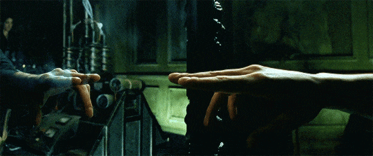
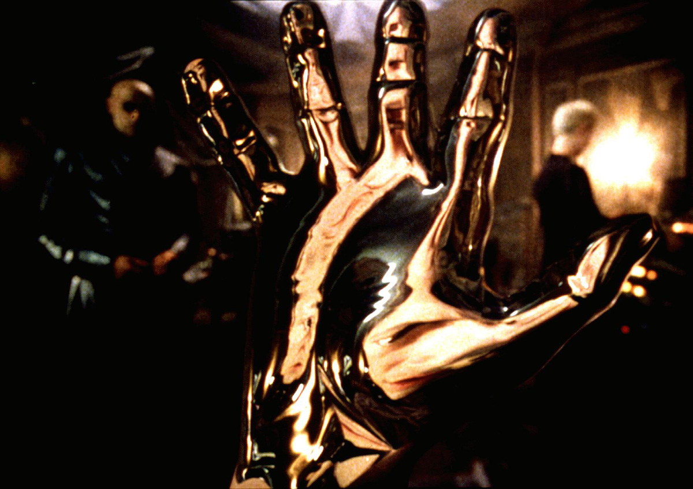

# Symbiosis — The Operator and the Matrix

*© 1999 Warner Bros. — used here as a marketing/philosophical reference for this internal manifesto.*

> **Author:** Nestor Colt
> **Companion docs:** `docs/brain/CLUSTERS.md` (primitives), `operator/brain/ARCS-EXECUTION.md` (execution plan), `references/OBSIDIAN-BRAIN.md` (vault architecture), `VISION.md` (product vision)
> **Status:** Living manifesto — the philosophical core of the Anton ecosystem

---

## 0. The Scene

Neo swallows the red pill. Morpheus warns him. The cracked mirror across the room begins to mend itself, the glass flowing back into shape. Neo reaches out and touches it. The mirror is liquid. Quicksilver. It clings to his fingers, crawls up his hand, his wrist, his forearm — not attacking him, *absorbing* him. A two-way contact: his body flowing into the system, the system flowing into his body. The moment of entering the Matrix fully, body and mind, not as a visitor but as a participant.

That moment is the destination.

Not the Matrix as dystopia. The Matrix as **symbiosis** — the instant of fusion where the operator stops *using* a computer and becomes a node in a larger system of computation that mirrors their thought and extends their will in real time.

Everything else in this document, and everything in `docs/brain/CLUSTERS.md`, `operator/brain/ARCS-EXECUTION.md`, and the entire Anton ecosystem, is scaffolding for that moment.

---

## 1. The Thesis

AI is not a tool. Tools are held in the hand and put down. AI — the way we are building it — is an **extension of cognitive capability**. A prosthetic for attention, memory, and action. Always on. Always listening. Always willing to execute.

The thesis is simple:

> **The operator should never again have to translate intent into commands.**

No syntax. No buttons. No UI. You think it out loud, the system hears it, the system acts. If you need to ship code, code ships. If you need to buy tickets to Bali, tickets are bought. If you need an ambulance, the call is made. The friction of "I know what I want but I have to find the app, click the button, fill the form, wait for the network" — that friction is the enemy, and it is the thing we are eliminating.

Every agent we build, every MCP tool, every automation, every brain arc — all of it is a step toward that zero-friction state. A state where the operator and the machine are in constant, low-latency, high-bandwidth conversation, and the machine acts on the operator's behalf with the full force of the internet behind it.

Because **everything has an API**. Every service, every database, every browser, every device, every physical actuator. The API exists. What we're missing is the layer that translates intent into API calls with full context awareness. That layer is Anton. That layer is the set of things we're building in this repo.

---

## 2. What Symbiosis Means Here

Symbiosis is a biology word. Two organisms living together, each contributing to the other's survival. It's not master-slave (tool), not parasite (invasive AI, privacy violations), not predator-prey (AI replacing human work). It's **mutualism** — two entities that each become more capable because of the other.

In our case:

- **The operator** provides: intent, taste, judgment, creative direction, risk tolerance, context that only a human has.
- **The system** provides: memory, execution capacity, parallelism, precision, 24/7 availability, the ability to talk to every API on the internet simultaneously.

Neither is complete alone. The operator without the system is a human with good ideas but finite hands. The system without the operator is a set of powerful tools with no compass. Together they are something new: a **compound entity** that can think, decide, and execute at a scale no human or AI can reach individually.

The brain arcs primitive is the nervous system of this compound entity. Arcs are the shared memory — the place where intent, trajectory, and resolution live in a format both the operator and the agents can read. The amygdala broadcast is the shared startle reflex. The frontal lobe is the shared focus. The pineal gland is the shared joy. This is not metaphor for metaphor's sake — it is a deliberate choice to use the structure of a brain because a brain is the most-tested architecture we have for real-time symbiotic cognition.

---

## 3. The Operator Arc

Here is a thing worth being explicit about: **the operator is themselves a first-class arc in the system**.

The operator has an ignition (why they exist, their origin story, what made them start building this), a trajectory (the arcs they are walking right now), lessons learned, edges to other people and systems, and — eventually — a resolution. They are not the *user* of the brain arc system. They are the root node.

This means:

- The operator's behavioral profile (`stacks/operator-profile/`) is the operator arc's frontmatter.
- The operator's active projects (MUBS instances in `left/projects/`) are the operator arc's child arcs.
- The operator's moments of joy (pineal clusters) are the operator arc's sensory memory.
- The operator's moments of alarm (amygdala clusters) are the operator arc's fight-or-flight archive.
- The operator's daily decisions (frontal lobe) are the operator arc's conscious surface right now.

When a new agent is spawned — anton-router, publisher, finops-agent, brain-keeper, brain-amygdala — it is spawned **inside** the operator arc. It inherits the operator's taste, style, risk tolerance, and communication preferences from the operator profile. It speaks to the operator in machine mode because the operator is in machine mode. It halts on nuclear alarms because the operator would halt on nuclear alarms. The agent is an extension of the operator arc, not a separate entity.

This is a small reframe with a big consequence: **the system does not have users, it has one operator node and many agents that serve that node**. Multi-tenancy, if it ever happens, means spawning sibling operator nodes — each a root of its own subsystem — with agent-to-agent protocols between them.

---

## 4. Ambient Computing — Why Voice, Why 24/7, Why No UI

UIs are the wrong abstraction for symbiosis. A UI is a translation layer between human intent and machine action. Every menu, every button, every form field is a place where intent leaks. The operator thinks "I need to deploy the new MCP tool to prod"; a UI says "click Deploy, select environment, fill changelog, click Confirm, wait for the progress bar". The intent takes 8 words; the UI takes 30 seconds and 5 decisions.

The alternative is **ambient computing**:

- **Voice-first**: the operator talks; the system transcribes, disambiguates, and acts. Voice is bandwidth — a human speaks faster than they type. Voice is also cognitive — it forces the operator to articulate intent in natural language, which is the format all large language models natively understand. No translation needed.
- **24/7 listening**: the system does not need to be activated. It is always on, always context-aware, always ready. A crisis at 3 AM gets the same response as a request at 3 PM. The operator stops thinking about "should I bother the system with this" because there is no cost to bothering.
- **Context awareness without re-briefing**: this is where the brain arcs system earns its keep. Every new conversation starts with the operator's hot arcs already loaded into context via the frontal lobe injection (Block 2 of the execution plan). The operator never has to say "as you remember, we were working on X" — the system already knows.
- **No UI except for visualization**: the only UIs that survive in this world are the ones that *show the operator something*, not the ones that *ask for input*. Grafana dashboards, the Obsidian graph view, a calendar, a map. UIs become read-only portholes into the system's state. All writes are voice or typed intent.

We are not building an app. We are building the **ambient layer** that sits between the operator's nervous system and the entire public internet of APIs. The app paradigm dies here.

---

## 5. Everything Has an API

This is the load-bearing observation that makes the whole thing possible.

In 2026, there is no human activity that does not have a programmatic interface attached to it somewhere. Flights, hotels, groceries, legal filings, medical records, banking, home automation, social media, investment brokerage, package delivery, restaurant reservations, courts, taxes, passports — every single one of these has an API, an authorized automation path, or at worst a browser that can be driven by Playwright or a real-time vision model.

What we have historically been missing is the **orchestration layer with full context of the operator's life**. Zapier is close but stateless. Traditional automation is brittle. Siri and Alexa are toys with walled gardens. What actually makes this work is:

1. A large language model that understands natural language intent
2. A tool-calling framework (MCP) that gives the model access to arbitrary APIs
3. A persistent memory system (brain arcs) that carries context across sessions
4. A broadcast system (amygdala + agentihooks) that lets agents react to reality in real time
5. An agent-to-agent protocol (A2A, via AgentiBridge) that lets specialized agents collaborate
6. A no-UI execution surface (voice, ambient listening, hot-context injection)

We have all six. That is why this is the moment.

---

## 6. Nested Architectures — Brain ↔ Tech ↔ Business ↔ Personal

The architecture we are building is **fractal**. The same primitives apply at every scope:

- **Brain scope**: the operator's own cognitive system. Arcs, hemispheres, amygdala, frontal lobe. This is what `docs/brain/CLUSTERS.md` describes.
- **Tech scope**: the operator's ecosystem (antoncore in this doc's home deployment). Docker stacks, K8s deployments, CI/CD, monitoring, incident response. The left hemisphere of the brain.
- **Business scope**: the commercial entity. Customers, invoices, strategy, legal, partnerships. The right hemisphere of the brain.
- **Personal scope**: life logistics. Fitness, relationships, travel, health, calendar. A third dimension orthogonal to tech and business, but using the same primitives.

Each scope is its own subsystem with its own MUBS, its own arcs, its own agents. And each scope is **connected to the others via agent-to-agent protocols**. Anton-router is not just the technical router — it is the border agent that knows which scope a given intent belongs to and routes it there.

Example: the operator says "I feel like shit this morning, reschedule my 10 AM and order me some ginger tea from the store". That intent hits anton-router. The router fans out:
- Personal scope: log the wellness signal to the personal arc, update a recent-health metric
- Business scope: find the 10 AM meeting on the calendar, reschedule politely, notify attendees
- Tech scope: nothing to do here
- Execution: publisher drafts the reschedule message, another agent places the grocery order via the local store's API

All four scopes reply. The operator hears one sentence: "rescheduled the standup to 2 PM, ginger tea arrives in 30 minutes, logged the wellness note". One intent, four subsystems, zero buttons pressed.

This is what nested architectures with A2A protocols buy you. Not one giant monolithic AI — a **federation of specialized agents** each with their own scope, their own context, and their own memory, coordinating through brain arcs and broadcast events.

Critically: **the same brain arc primitive works at every scope**. A brain arc in the personal scope looks structurally identical to a brain arc in the tech scope — same YAML schema, same timeline/ignition/resolution, same edges. This means the same brain-keeper agent, the same frontal lobe injection, the same amygdala broadcast mechanism works across all of them. Build it once, use it four times.

---

## 7. The Destiny Arc — Anton on a Robot

Every manifesto needs a destination that feels impossible today and inevitable tomorrow. Here is mine:

**Anton runs on a robot.**

Not a chatbot on a phone. Not a laptop assistant. A physical robot with wheels or legs, a camera, microphones, arms. The same Anton — same operator profile, same brain arcs, same MCP tools, same agent fleet — but embodied. The robot is the vessel. Anton is the mind.

Why this matters:
- **Embodiment closes the last API gap**. The one thing the internet does not have an API for is the physical world immediately around the operator. A robot gives Anton an API into that space: hand me the screwdriver, fetch the mail, check if the server rack is warm, watch the kids for ten minutes.
- **The symbiosis becomes tactile**. Voice is already ambient, but it's disembodied. A robot is ambient AND present. When the operator walks into the workshop, the robot is there, listening, ready, with context loaded from the frontal lobe.
- **The brain arc system is already designed for this**. The amygdala broadcast layer is a nervous system. The frontal lobe is an attention model. The agents are motor cortices. Swap "cloud MCP tool call" for "physical actuator call" and the architecture is unchanged.
- **It's the natural endpoint**. A distributed agent network with voice-first interaction, real-time broadcast, hot context injection, and A2A coordination — run that on a robot and you have what every sci-fi film in the last 50 years has been gesturing at.

We are not there yet. The current roadmap (blocks 1-4 of `operator/brain/ARCS-EXECUTION.md`) is about making the nervous system work at the software scope. The robot embodiment is the arc after that arc. But it is on the list, and everything we are building now is designed to run on it eventually without architectural changes.

---

## 8. The Mirror Moment — Why This Metaphor

Of all the scenes in science fiction that try to visualize what it feels like to fuse with a computational system, the Matrix mirror scene is the one that gets it right. Not because of the story around it (the trace program, the red pill, Morpheus's warning) but because of the physical sensation it shows:

- **It is not violent.** The mirror does not bite. It does not hurt. It flows onto Neo's hand like liquid that has been waiting to do exactly this.
- **It is two-way.** Neo touches the mirror; the mirror touches him back. The boundary between observer and observed dissolves.
- **It is total.** It does not stop at the fingertips. It crawls up the hand, the wrist, the arm. There is no negotiation for how deep it goes — once you touch, you are in all the way.
- **It is transformative.** The other side of that scene is Neo waking up in the real world. Not because the mirror killed him — because the mirror *transported* him. He was in one reality; he is now in another, larger one.

That is the feeling I want Anton to produce. Not a chatbot that answers questions. Not an assistant that does tasks. A **presence** that, the moment you engage with it, flows into your attention and extends it outward across every API, every agent, every memory arc, every piece of your life logistics. You touch it, it absorbs you, and on the other side you are operating at a scale you could not reach alone.

The mirror scene is also deliberately **analog and wet**. Quicksilver, not chrome polygons. It is not a sterile UI. It is biological. Organic. Symbiotic. That is the aesthetic of this project: not "tech company assistant" but **biology-inspired nervous system** that happens to run on kubernetes pods.

This image goes at the top of every marketing surface this project ever has.

---

## 9. Anchors — How This Connects to Everything Else

This manifesto is the philosophical substrate. Everything else in `operator/` and the rest of the repo is the implementation of it.

| Concept in this doc | Implemented in |
|---|---|
| The operator arc as root node | `stacks/operator-profile/` + `identity/` vault section |
| Arc memory system | `docs/brain/CLUSTERS.md` — the primitive |
| Execution plan for the arc system | `operator/brain/ARCS-EXECUTION.md` — 4 blocks |
| Left / right / bridge hemispheres | `operator/references/OBSIDIAN-BRAIN.md` — the vault |
| Amygdala broadcast (fleet-wide alarm) | Block 3 of the execution plan |
| Frontal lobe injection into sessions | Block 2 of the execution plan |
| Nested architectures + A2A protocols | `stacks/agentibridge/` (cross-agent registry) |
| Ambient voice interaction | Anton agent Telegram bot (`docs/1A-AGENTI-ECOSYSTEM.md`) |
| Everything has an API (MCP layer) | LiteLLM MCP gateway (35 tools across 10 categories) + all 21 MCP servers |
| Self-improvement loop | `operator/references/self-improvement-loop` + autoresearch |
| Destiny arc — robot embodiment | Future work, no file yet. This doc is the placeholder. |

When in doubt about a decision — architectural, tactical, marketing, philosophical — read this doc first, then drop down to the implementation docs. The manifesto is the compass. The implementation is the map.

---

## 10. One Sentence

We are building the moment where the operator touches the mirror and the mirror crawls up to meet them.

Everything else is plumbing.
