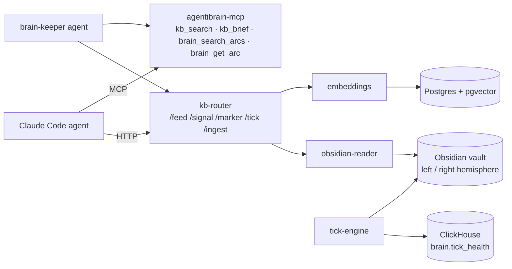

# AgentiBrain
{: .fs-9 .fw-700 }

The brain + KB substrate for Claude Code agent fleets — services, Helm charts, agent definition, profile overlays, and the vault schema, in one self-contained kernel.
{: .fs-5 .text-grey-dk-100 .mb-6 }

<div class="hero-actions text-center mb-8" markdown="0">
  <a href="#install" class="btn btn-primary fs-5 mr-2">Get Started</a>
  <a href="{{ site.baseurl }}/docs/00-INDEX" class="btn btn-green fs-5 mr-2">Browse Docs</a>
  <a href="https://github.com/The-Cloud-Clockwork/agentibrain-kernel" class="btn fs-5" target="_blank">View on GitHub</a>
</div>

[](https://github.com/The-Cloud-Clockwork/agentibrain-kernel/blob/main/LICENSE)
[](https://github.com/The-Cloud-Clockwork/agentibrain-kernel/actions/workflows/ci.yml)
[](https://python.org)
{: .text-center .mb-8 }

---

## What you get
{: .fs-7 .fw-600 }



- **5 service images** auto-published to GHCR — `kb-router`, `obsidian-reader`, `embeddings`, `mcp`, `tick-engine`.
- **6 Helm charts** — the five services above plus `brain-cron` and `brain-keeper`.
- **Brain-keeper agent definition** in-tree (`agents/brain-keeper/`) — drop-in Claude Code custom agent.
- **Brain profile overlays** for [agentihooks](https://github.com/The-Cloud-Clockwork/agentihooks) — markers, broadcast channels, hook wiring.
- **Vault schema v1** — six-region Obsidian vault layout that the kernel writes to.
- **HTTP contract frozen at v1** — see [`api/openapi.yaml`](https://github.com/The-Cloud-Clockwork/agentibrain-kernel/blob/main/api/openapi.yaml).
- **Generic OpenAI gateway** — kernel speaks chat-completions to any compatible upstream (LiteLLM, OpenAI, Ollama, vLLM, …).

---

## Install
{: .fs-7 .fw-600 }

### 1. Laptop (Docker Compose)

```bash
git clone https://github.com/The-Cloud-Clockwork/agentibrain-kernel
cd agentibrain-kernel
./local/bootstrap.sh
docker compose up -d
```

Five services on localhost — see [`local/README.md`](https://github.com/The-Cloud-Clockwork/agentibrain-kernel/blob/main/local/README.md).

### 2. Kubernetes (Helm)

```bash
helm dep update helm/kb-router
helm install kb-router helm/kb-router -n brain --create-namespace
# repeat for obsidian-reader, embeddings, mcp, brain-cron, brain-keeper
```

Bare-cluster path with no operator infra required — see [`docs/HELM-QUICKSTART.md`]({{ site.baseurl }}/docs/HELM-QUICKSTART). For ArgoCD + ESO + multi-source patterns: [`docs/DEPLOYMENT.md`]({{ site.baseurl }}/docs/DEPLOYMENT).

### 3. PyPI (CLI only)

```bash
pip install agentibrain
brain init --local
```

Scaffolds the vault schema and emits `.env`. CLI: `brain init|up|down|status|tick|scaffold|version`.

---

## Connect Claude Code
{: .fs-7 .fw-600 }

### Laptop — `.mcp.json`

```json
{
  "mcpServers": {
    "agentibrain": {
      "url": "http://localhost:8104/mcp",
      "headers": {
        "Authorization": "Bearer ${MCP_PROXY_API_KEY}"
      }
    }
  }
}
```

### Agent mode (in-cluster)

```json
{
  "mcpServers": {
    "agentibrain": {
      "url": "http://agentibrain-mcp.<your-namespace>.svc:8080/mcp",
      "headers": {
        "Authorization": "Bearer ${MCP_PROXY_API_KEY}"
      }
    }
  }
}
```

Full wiring + auth notes: [`docs/MCP.md`]({{ site.baseurl }}/docs/MCP).

---

## Documentation
{: .fs-7 .fw-600 }

| Topic | What's there |
|---|---|
| [HTTP API]({{ site.baseurl }}/docs/API) | `/feed /signal /marker /tick /ingest` contract |
| [MCP server]({{ site.baseurl }}/docs/MCP) | `kb_search`, `kb_brief`, `brain_search_arcs`, `brain_get_arc` |
| [Vault schema]({{ site.baseurl }}/docs/VAULT-SCHEMA) | Six-region Obsidian layout, schema marker |
| [Helm quickstart]({{ site.baseurl }}/docs/HELM-QUICKSTART) | Bare-cluster install with no operator infra |
| [Deployment]({{ site.baseurl }}/docs/DEPLOYMENT) | ArgoCD + ESO + multi-source patterns |
| [Secrets]({{ site.baseurl }}/docs/SECRETS) | Plain Opaque or ESO-synced; the choice is yours |
| [Operations]({{ site.baseurl }}/docs/OPERATIONS) | Day-2 runbook — monitor, scale, drain, backup |
| [Troubleshooting]({{ site.baseurl }}/docs/TROUBLESHOOTING) | Top failure modes with fixes |
| [Glossary]({{ site.baseurl }}/docs/GLOSSARY) | MUBS, arc, signal, marker, tick, hemisphere |
| [Migration]({{ site.baseurl }}/docs/MIGRATION) | Swapping a legacy brain for the kernel |
| [Architecture]({{ site.baseurl }}/docs/architecture/ARCHITECTURE) | Full design — services, data plane, control plane |
| [Markers]({{ site.baseurl }}/docs/architecture/MARKERS) | `<!-- @lesson -->`, `<!-- @signal -->`, `<!-- @milestone -->` |

Full index: [`docs/00-INDEX.md`]({{ site.baseurl }}/docs/00-INDEX).

---

## Status

**v0.1.1 — first stable.** Six Helm charts, five service images on GHCR (`:dev` from dev branch, `:latest` from main), HTTP contract frozen at v1, brain-blind boundary in place since 2026-04-26 (artifact-store no longer auto-embeds; every embed flows through `POST /index_artifact`).

The kernel is self-contained and the canonical source of truth for everything brain-related — services, Helm charts, brain-keeper agent definition, brain profile overlays, and the vault layout schema. All deployment-specific plumbing (cluster namespaces, model name aliases, secret-store paths, NFS hosts) lives in your own platform repo, not here.
